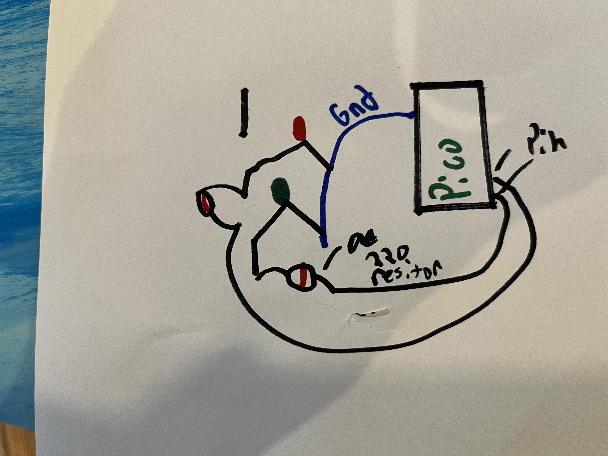
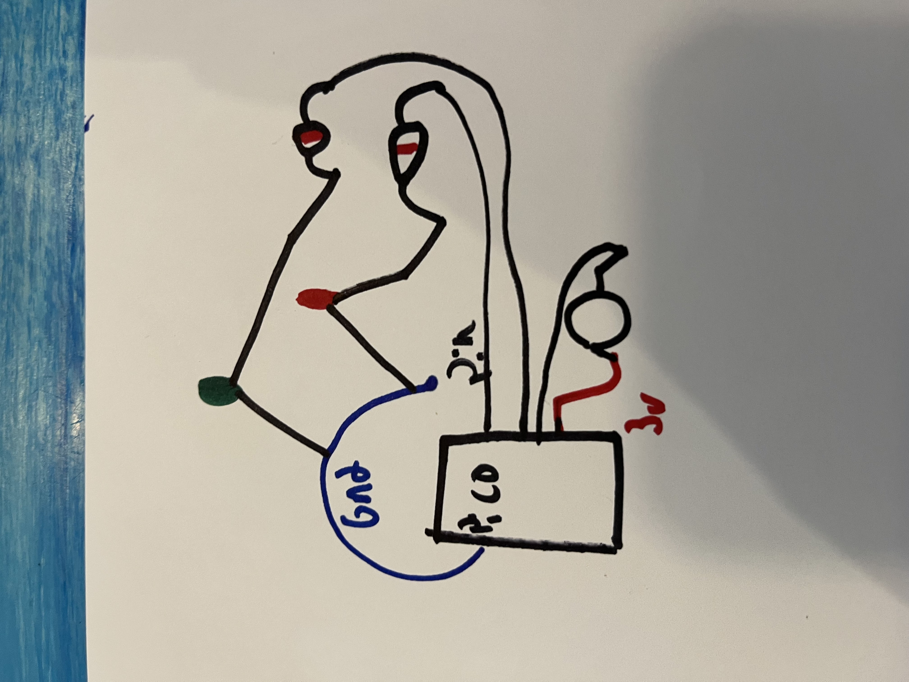
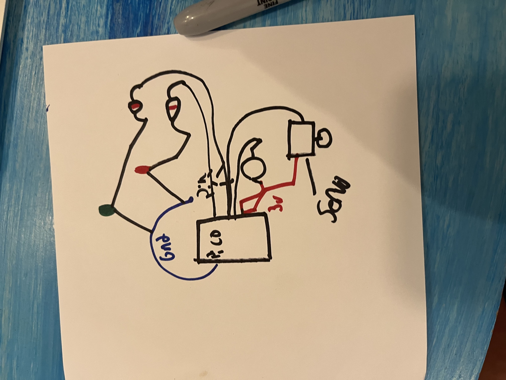
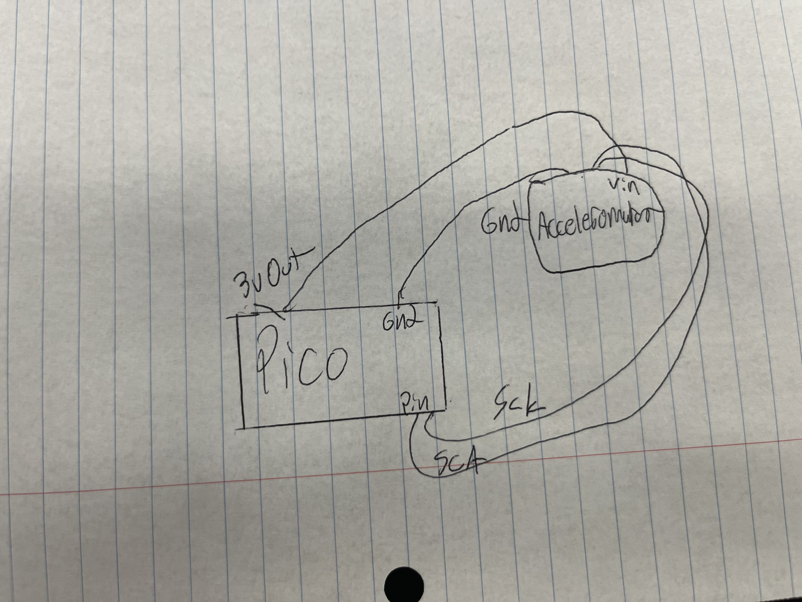
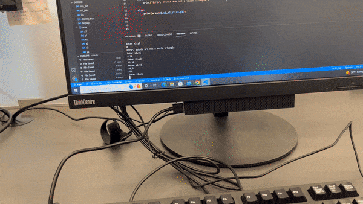
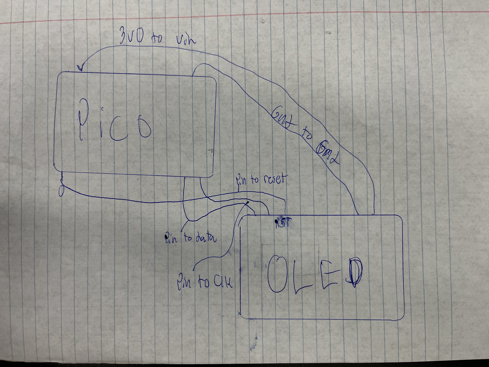
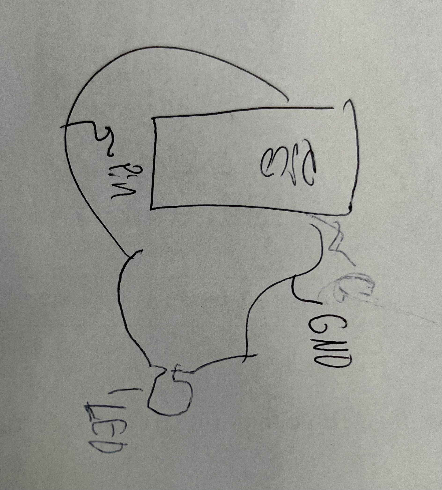
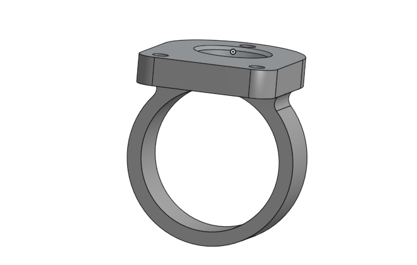

# Engineering_4_Notebook

&nbsp;

## Table of Contents
* [Onshape_Assignment_Template](#Onshape_Assignment_Template)
* [Countdown 1](#Countdown_1)
* [Countdown 2](#Countdown_2)
* [Countdown 3](#Countdown_3)
* [Countdown 4](#Countdown_4)
* [Crash avoidance 1](#Crash_avoidance_1)
* [Crash avoidance 2](#Crash_avoidance_2)
* [Landing Area 1](#Landing_Area_1)
* [Landing Area 2](#Landing_Area_2)
* [Morse Code 1](#Morse_Code_1)
* [Morse Code 2](#Morse_Code_2)
* [FEA_Part 1](#FEA_Part_1)
* [FEA_Part 2](#FEA_Part_2)
* [FEA_Part 3](#FEA_Part_3)
* [Extra Design](#Extra_Design)
## Countdown_1

### Assignment Description

Make serial countdown from 10 to 1 and read "Takeoff!"

### Evidence 


### Wiring


No wiring

### Code
``` python
import time
for x in range (10,0,-1):  #Range from 10,0 count down -1 each second
    print(x)
    time.sleep (1)  # Second between each number
print("Takeoff!")   # print this at 0
``` 

### Reflection

The most challenging part of this assingment for me was figuring out the for loop. At first I only had (10, 0) This countdown from 0-10. To do the oppisite and to complete the assingment I had to use "for (0, 10, -1) The -1 clarifies direction which allows the count DOWN.

## Countdown_2

### Assingment description

Have green led to blink every second of countdown and red to go off when countdown is finished.

### Evidence 


### Wiring



### Code
``` python
import time 
import board
import digitalio 

GreenLed = digitalio.DigitalInOut(board.GP13)
GreenLed.direction = digitalio.Direction.OUTPUT 
RedLed = digitalio.DigitalInOut(board.GP18) 
RedLed.direction = digitalio.Direction.OUTPUT 

for x in range (10,0,-1):  
    GreenLed.value = True #Turns led on intially
    time.sleep(0.5) # sleep half second
    print(x) # continues  countdown
    led1.value = False #turns led off
    time.sleep(0.5) # sleep other half second
while True:
    print("Takeoff!") 
    RedLed.value = True #Red Led turns on at end of countdown
    time.sleep(0.5) # Led turns off
 ``` 

### Reflection

At first I had both legs of the led wired in the same row, which clearly wont work. I then put one leg in the coloumn with ground, and the other with a resitor, with the resistro connected to the desired pin with another wire. The other part was getting the time.sleep corrrect, instead of on time.sleep(1), I have 2 time.sleep(0.5) which works better. 

## Countdown_3

### Assingment description

Have green led to blink every second of countdown and red to go off when countdown is finished.
### Evidence 


### Wiring



### Code
``` python
import time 
import board
import digitalio

GreenLed = digitalio.DigitalInOut(board.GP13)  
GreenLed.direction = digitalio.Direction.OUTPUT
RedLed = digitalio.DigitalInOut(board.GP18)
RedLed.direction = digitalio.Direction.OUTPUT
button = digitalio.DigitalInOut(board.GP16) 
button.direction = digitalio.Direction.INPUT # Leds are output, Button is an Input
button.pull = digitalio.Pull.UP 

while True: 
     if button.value == False: # Button initializes code
          for x in range (10,0,-1):  
    GreenLed.value = True #Turns led on intially
    time.sleep(0.5) # sleep half second
    print(x) # continues  countdown
    led1.value = False #turns led off
    time.sleep(0.5) # sleep other half second
     while True:
         print("Takeoff!") 
         RedLed.value = True #Red Led turns on at end of countdown
         time.sleep(0.5) # Led turns off
``` 
### Reflection

This assingment retaught me how to use a button. The previous LEDs were an output, whereas the button is an input. At first The button didnt work because I made the mistake of switcthing them, but then it worked. button.value == False instead of true to be pressed and initalize code with digitalio.Pull.UP

##  Countdown_4

### Assingment description

Have green led to blink every second of countdown and red to go off when countdown is finished, also have servo turn 180 degress when countdown is finsihed.

### Evidence 


### Wiring
 


### Code

``` python

servo.angle = 0

     if button.value == False: # Button initializes code
     for x in range (10,0,-1):  
     GreenLed.value = True #Turns led on intially
     time.sleep(0.5) # sleep half second
     print(x) # continues  countdown
     led1.value = False #turns led off
     time.sleep(0.5) # sleep other half second
     while True:
     print("Takeoff!") 
     RedLed.value = True #Red Led turns on at end of countdown
     time.sleep(0.5) # Led turns off
     while True:
          print("liftoff!")     #say liftoff
          led2.value = True
          servo.angle = 180  #Turn Servo from 0 degrees to 180
          time.sleep(0.5)

``` 


### Reflection

The code to initialize the servo was given and pretty simple. One part was setting the servo to start at 0 degrees, servo.angle = 0, if you dont do this, the code     servo.angle = 180  #Turn Servo from 0 degrees to 180 wil not work. The servo without this code starts at 180 degrees.


## Crash_Avoidance_1

### Assingment description

Using an accleratmatoer, print the x, y, and z values on the serial monitor.

### Evidence 


### Wiring



### Code
``` python
import board 
import adafruit_mpu6050
import busio 
import time
import digitalio 


sda_pin = board.GP16  # Accelermatoer 
scl_pin = board.GP17
i2c = busio.I2C(scl_pin, sda_pin)
mpu = adafruit_mpu6050.MPU6050(i2c)


while True:
    print(mpu.acceleration)   # print x y and z values
    time.sleep(.5)
``` 
### Reflection

The code for this assingment is simple, but the wiring could be tricky. At first I switched SDA and SCL pin, and my code didnt work, then I switched them and it did. Other than the imports and the varaible stuff the only code you need is print(mpu.acceleration).

## Crash_Avoidance_2

### Assingment description

Using an accleratmatoer, print the x, y, and z values on the serial monitor. When acceleramtor is turned 90 degrees to either side, light up led

### Evidence 


### Wiring


### Code
``` python
import board 
import adafruit_mpu6050
import busio 
import time
import digitalio 

led = digitalio.DigitalInOut(board.GP1) 
led.direction = digitalio.Direction.OUTPUT
sda_pin = board.GP16  # Accelermatoer 
scl_pin = board.GP17
i2c = busio.I2C(scl_pin, sda_pin)
mpu = adafruit_mpu6050.MPU6050(i2c)


while True:
    print(mpu.acceleration)   # print x y and z values
    time.sleep(.5)

    if mpu.acceleration[0] < -9 or mpu.acceleration[0] > 9: # if x value less then -9 ot greater than 9
        led.value = True  # at these values, 90 degrees, led turns on.
    else:
        led.value = False  #if its not then the led is off
  ``` 

### Reflection

At first the mobile power source I was using didnt seem to work. This was because I had written my code in a file Crash2.py. and I hadn't uplaoaded it to code.oy file. Once I did this the mobile power source worked. Other than that the only change in code was having led turn on when the accerleramoter was turned 90 degrees which can be done if mpu.acceleration[0] < -9 or mpu.acceleration[0] > 9. If x value was less than -9 or greater than 9 it was at 90 degrees.

## Landing_area_1 

### Assingment description

Code asked user to inpput 3 point (x1,y1) etc, when 3 points are entered, code spits out area. If invalid point is entered (d,3) code prints "Error, points are not a valid triangle"

### Evidence 


### Wiring

No wiring

### Code
``` python
def area(x1,y1,x2,y2,x3,y3): # Def all variables
    float(x1) # Turn from float to int
    float(y1)
    float(x2)
    float(y2)
    float(x3)
    float(y3)
    a1 = int(1/2*(x1*(y2-y3)+x2*(y3-y1)+x3*(y1-y2))) # Formula for area from 3 points of triangle 
    area = abs(a1)
    return area

while True: 
    try:
        print('Enter x1,y1') # ask for first input, 
        x1y1 = input()
        xlist = x1y1.split(",") #create list split vairables, repeat for each variable
        x1=float(xlist[0])
        y1=float(xlist[1])
        print('Enter x2,y2')
        x2y2 = input() 
        x2list = x2y2.split(",")
        x2=float(x2list[0])
        y2=float(x2list[1])
        print('Enter x3,y3')
        x3y3 = input()
        x3list = x3y3.split(",")
        x3=float(x3list[0])
        y3=float(x3list[1])

        
    except:  
        print("Error, points are not a valid triangle") #If input not a number

    else:
        print(area(x1,y1,x2,y2,x3,y3)) # print asnwer to formula   
``` 

### Reflection

The hardest part of this assingment for me was converting the int to float. To use in equation variable x1,y1 etc have to be integers but for most else they have to be float. To convert to float its as simple as float(x1), to convert back to int in equation int()


## Landing_area_2

### Assingment description

Code asked user to inpput 3 point (x1,y1) etc, when 3 points are entered, code spits out area. If invalid point is entered (d,3) code prints "Error, points are not a valid triangle" Graph triangle from 3 points inputed on OLED screen.

### Evidence 



### Wiring





### Code
``` python


def area(x1,y1,x2,y2,x3,y3): # all variables
    float(x1) # turn all variables from int to float
    float(y1)
    float(x2)
    float(y2)
    float(x3)
    float(y3)
    a1 = int(1/2*(x1*(y2-y3)+x2*(y3-y1)+x3*(y1-y2))) # formula for area of triangle from 3 points
    area = abs(a1) # absolute value of found area
    return area

while True: 

    try:
        print('Enter x1,y1') # ask for first input
        x1y1 = input()
        xlist = x1y1.split(",")
        x1=float(xlist[0])
        y1=float(xlist[1]) # Create list, spilt x1 and y1, repeat for all variables
        print('Enter x2,y2')
        x2y2 = input() 
        x2list = x2y2.split(",")
        x2=float(x2list[0])
        y2=float(x2list[1])
        print('Enter x3,y3')
        x3y3 = input()
        x3list = x3y3.split(",")
        x3=float(x3list[0])
        y3=float(x3list[1])

        splash = displayio.Group()  #create the display group
        hline = Line(0,32,128,32, color=0xFFFF00,) # create lines of triangle
        splash.append(hline) 
        h2line = Line (64,0,64,64, color=0xFFFF00,)
        splash.append(h2line)
        circle3 = Circle(64,32,1, outline=0xFFFF00) # circle at origin
        splash.append(circle3)
        triangle = Triangle(int(x1) + 64, 32 - int(y1), 64 + int(x2), 32 - int(y2), 64 + int(x3), 32 - int(y3), outline=0xFFFF00) # Create triangle
        splash.append(triangle) 

       
        display.show(splash)

        
    except: 
        print("Error, points are not a valid triangle")

    else:
        print(area(x1,y1,x2,y2,x3,y3))   # print asnwer to formula (area)
     
 ```

### Reflection

To print the triangles for this assingment you couldnt just input 'triangle = Triangle(int(x1), int(y1), int(x2), int(y2), int(x3), int(y3))'
as this would print the trirangle on the wrong part of the graph. Since the OLED is 128 by 64, to get the tirangle to plot with respect to the origin (64,32) you have to add 64 to each x value (int(x1) + 64) and subtract each y value from 32 (32 - int(y1).

## Morse_code_1

### Assingment description

Script asks for input from user, user gives letter or number input, script returns input in morse code with / represeting space. Can input lower case or upper case letters and code turn into upper case.

### Evidence 


### Wiring

No wiring

### Code
  
``` python
  
  print("Enter Morse Code Message, or enter -q to quit") ##  Initial message that will be printed
  MORSE_CODE = { 'A':'.-', 'B':'-...',      ## start of dictionary
  'C':'-.-.', 'D':'-..', 'E':'.',
  'F':'..-.', 'G':'--.', 'H':'....',
  'I':'..', 'J':'.---', 'K':'-.-',
  'L':'.-..', 'M':'--', 'N':'-.',
  'O':'---', 'P':'.--.', 'Q':'--.-',
  'R':'.-.', 'S':'...', 'T':'-',
  'U':'..-', 'V':'...-', 'W':'.--',
  'X':'-..-', 'Y':'-.--', 'Z':'--..',
  '1':'.----', '2':'..---', '3':'...--',
  '4':'....-', '5':'.....', '6':'-....',
  '7':'--...', '8':'---..', '9':'----.',
  '0':'-----', ', ':'--..--', '.':'.-.-.-',
  '?':'..--..', '/':'-..-.', '-':'-....-',
  '(':'-.--.', ')':'-.--.-', ' ':'/',} ## Added ':'/', for space

  message = input("") 
  message = message.upper()  ## Turns input of lower cas letter to uppercase

  message1 = " " 

  for letter in message: ## input to morse code
    message1 = message1 + (MORSE_CODE[letter]) + " " ## final message = morsecode letter, allows letters to space 

  print(message1) 
  
  ```
  
### Reflection

The main part of this assingment that I had never seen was the dictionary. The dictionary is what allows each individual letter to be turned into morse code. 
At first I didn't know how to have "/" return from a space input. To fix this I added it to the dictionary which turned the letter into morse code originally. ' (''/',)  To do this it was as simple as saying what the input would be " " and saying what I wanted the output to be '/'.


## Morse_code_2

### Assingment description

Script asks for input from user, user gives letter or number input, script returns input in morse code with / represeting space. Can input lower case or upper case letters and code turn into upper case. Additionally, morse code message is blinked through led.

### Evidence 


### Wiring




### Code
  
``` python
  
  modifier = 0.25 ## modifier for eacc break between dots, dash, etc etc
dot_time = 1*modifier
dash_time = 3*modifier
between_taps = 1*modifier
between_letters = 3*modifier
between_words = 7*modifier

while True:
  
  print("Enter Morse Code Message, or enter -q to quit") ## same dictionary
  MORSE_CODE = { 'A':'.-', 'B':'-...',
  'C':'-.-.', 'D':'-..', 'E':'.',
  'F':'..-.', 'G':'--.', 'H':'....',
  'I':'..', 'J':'.---', 'K':'-.-',
  'L':'.-..', 'M':'--', 'N':'-.',
  'O':'---', 'P':'.--.', 'Q':'--.-',
  'R':'.-.', 'S':'...', 'T':'-',
  'U':'..-', 'V':'...-', 'W':'.--',
  'X':'-..-', 'Y':'-.--', 'Z':'--..',
  '1':'.----', '2':'..---', '3':'...--',
  '4':'....-', '5':'.....', '6':'-....',
  '7':'--...', '8':'---..', '9':'----.',
  '0':'-----', ', ':'--..--', '.':'.-.-.-',
  '?':'..--..', '/':'-..-.', '-':'-....-',
  '(':'-.--.', ')':'-.--.-', ' ':'/',}

  message = input("") 
  message = message.upper()  ## turn lowercase letter to uppercase 

  message1 = " " 

  for letter in message: 
    message1 = message1 + (MORSE_CODE[letter]) + " " 

  print(message1)
  

  for character in message1: #loop thru morse message
    if character == ("."): ## If dot, then print dot_time break, then turn led off 
      led.value = True
      time.sleep(dot_time)
      led.value = False
    if character == ("-"): ## Repeat for each charectar
      led.value = True
      time.sleep(dash_time)
      led.value = False
    if character == (""):
      led.value = True
      time.sleep(between_letters)
      led.value = False
    if character == ("/"):
      led.value = True
      time.sleep(between_words)
      led.value = False
    time.sleep(between_taps) ## Sleep between charectars
  ```
  
### Reflection

At first I didn't know how to incorparate the (dot_time) into the led blink. Instead of the led being on for (dot_time) etc, have time.sleep(dot_time) etc for each value. I also didn't realize what (Between_taps) was at first, unlike the other time.sleep, this does not need an if statement, as it is to have a time.sleep between every charetar read.


## Onshape_Assignment_Template

### Assignment Description

Write your assignment description here. What is the purpose of this assignment? It should be at least a few sentences.

### Part Link 

[Create a link to your Onshape document](https://cvilleschools.onshape.com/documents/003e413cee57f7ccccaa15c2/w/ea71050bb283bf3bf088c96c/e/c85ae532263d3b551e1795d0?renderMode=0&uiState=62d9b9d7883c4f335ec42021). Don't forget to turn on link sharing in your Onshape document so that others can see it. 

### Part Image

Take a nice screenshot of your Onshape document. 

### Reflection

What went wrong / was challenging, how'd you figure it out, and what did you learn from that experience? Your goal for the reflection is to pass on knowledge that will make this assignment better or easier for the next person. Think about your audience for this one, which may be "future you" (when you realize you need some of this code in three months), me, or your college admission committee!

&nbsp;

  ## FEA_Part_1
### Description
Design a beam within the required parameters to hold as much load as possible.

### Part Image


### Reflection
Our initial design is based on an I beam. But instead of making an I beam we used triangles so that there was more support and rigidity. But since we needed to get rid of weight we needed to cut holes into the sides so that the total beam weight is >= 13 grams. We did pretty good on our first idea considering that we also got rid of alot of weight by getting rid of extra hangovers that wouldnt've didnt give as much support as it should've considering all the weight it was. To improve we want to find a way to make the ways thicker so they are less fkimsy. 

## FEA_Part_2
### Description
Set up our simscale workflow simulation and run it with out beam to find the weak points and evetnaully optimize it. 

### Part Image


### Reflection
We did decent on our first attempt but made alot of changes. We ended up making changes to the beam so that there was more support on weak points and less support on strong points. As we added more support there was also weight that was added. So we took cut more triangles in places that didnt need support and took of 2 support walls to cut weight. Once we got down to an acceptable weight we then retested the beam, and it had improved. We learned that  simscale simulation can help us optimize our beam.

## FEA_Part_3
### Description
Iterative Design cycle where we improve our beam and test it again to fully optimize it. 

### Part Image


### Reflection
As you can see we added more triangles to take stress off of weak points and we ended up adding more support in the center of the beam. We decided to get rid of a diamond in the pattern on the side wall and add a triangle and a smaller diamond to reduce stress. When we retested it we got a better score on this beam compared to the first beam.   

## Extra_Design

### Description
Failed extra design

### Part Image


### Reflection
In what we thought would be a fix for our final design, we added beams in the middle of all the triangles. This was to counteract the stress which was conectrated at the top of these triangles. When we ran the simulation for this design, the Von Mises stress was higher, which was weird. Also the stress point was in a place that didn't make sense. In the end we ended up not going with this design for these reasons. 

## 4.1 Ring and spinner

### Assignment Description

With a partner design a the first two pieces of the assingment the right and spinner. I designed the ring

### Images


### Evidence
https://cvilleschools.onshape.com/documents/df8a4669033c661f48e37312/w/f5fa1dc22a3f42fc88681d95/e/0cc1387392edf67199f3c258?renderMode=0&uiState=6408a19317e9d969bd9a9cf9 
 

### Reflection

This assingment was realtively simple and layed out step by step. I learned how to use a helix for the first time. Nothing else was new 

## Media Test

Your readme will have various images and gifs on it. Upload a test image and test gif to make sure you've got the process figured out. Pick whatever image and gif you want!

### Test Link

  [Hyperlink text](https://www.youtube.com/watch?v=z4t1CC7-UFE)      

### Test Image

   

### Test GIF

    
  

